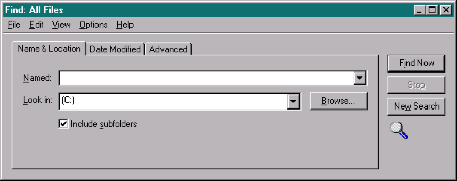
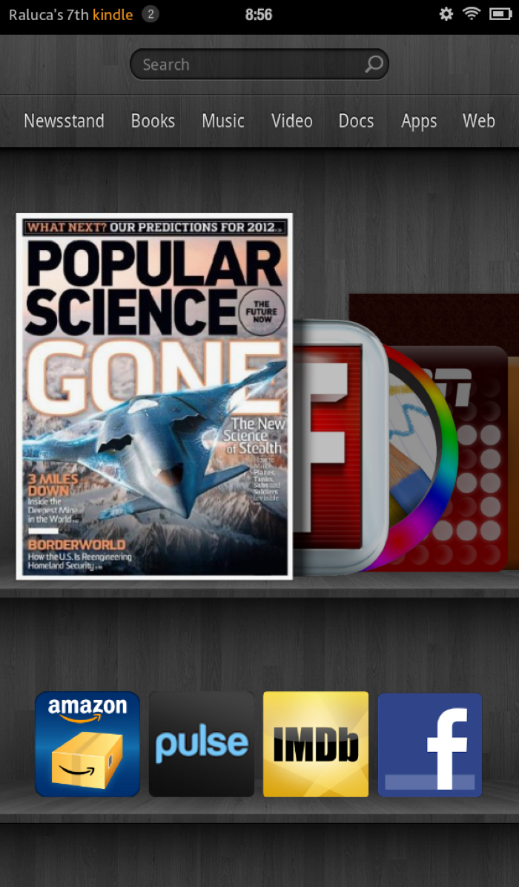
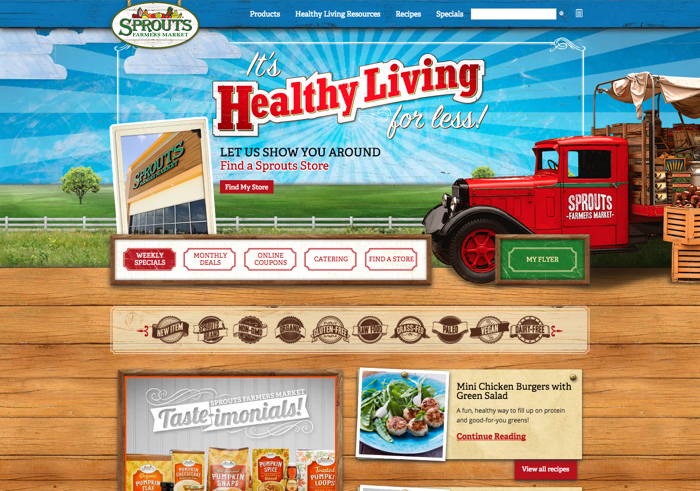
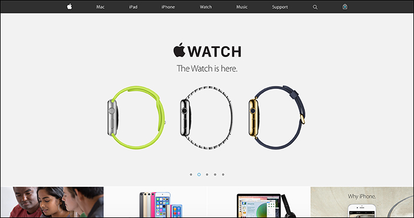
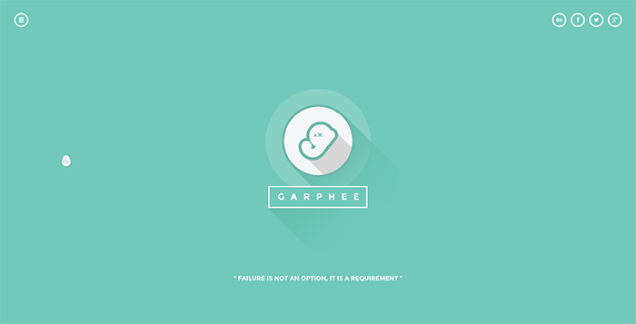
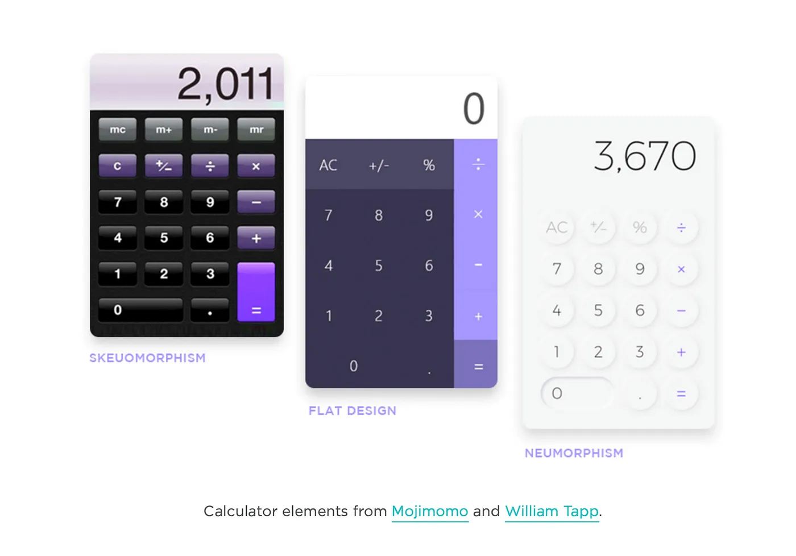

# Design

Notes on many forms of design ranging from print and digital media to typography to UI/UX.
{: .fs-6 .fw-300 }

## UI and UX Design

Additional resources:
* [Mobile Navigation Patterns by NN/g](https://www.nngroup.com/articles/mobile-navigation-patterns/)
* [“Mobile First is Not Mobile Only” by NN/g](https://www.nngroup.com/articles/mobile-first-not-mobile-only/)
* [Hamburger Menus and Hidden Navigation Hurt UX Metrics by NN/g](https://www.nngroup.com/articles/hamburger-menus/)
* [How to Make Navigation Discoverable on Mobile by NN/g](https://www.nngroup.com/articles/find-navigation-mobile-even-hamburger/)
* [Maximize Content-Chrome Ratio, not Content](https://www.nngroup.com/articles/content-chrome-ratio/)
* [Defer Secondary Content When Writing for Mobile Users](https://www.nngroup.com/articles/defer-secondary-content-for-mobile/)

## Design Trends

For an overview of trends and tradeoffs, see this article from [Nielsen Norman Group](https://www.nngroup.com/articles/flat-design/).

### 3D Design

### Skeuomorphism

Using elements from the real-world to support a metaphor that helps the user understand the interface.

### Realism

Skeuomorphism is often confused with realism. In web design, the two styles are usually found together. The primary distinction is that realism is a visual style that uses design elements and textures that mimic the physical world for purely aesthetic purposes, while skeuomorphism supports a metaphor to help users understand the interface.

### Flat

Remove all drop shadows and design cues to mimic the real world.

### Flat 2.0

Like flat, but bringing back some subtle clickability signifiers like drop-shadows.

Note: This example uses extremely long shadows which is advised against.

### Neumorphism

A focus on minimalism and lighting.

https://medium.com/throughdesign/neumorphism-and-what-it-means-27c23da8576e

## Forms

Resources:
* [Design of Forms](https://design-of-forms.online/)
* [Forms that Work](https://app.thestorygraph.com/books/300338d2-2718-417c-9d8d-40c9354caee9)
* [Good Services](https://app.thestorygraph.com/books/d0fc3539-07bb-4040-808b-a307a3584115)

## Illustration

Resources:
* [Simply draw: learn to draw](https://apps.apple.com/us/app/simply-draw-learn-to-draw/id1639875485)
* [CtrlPaint: learn digital painting](https://www.ctrlpaint.com/)

## Color Theory

**Tools**
* [Adobe Color Wheel](https://color.adobe.com/create/color-wheel)

## Typography

Typography is the style and appearance of (digitally or physically) printed text.

Additional resources:
  * [guide to choosing type](https://fonts.google.com/knowledge/choosing_type)

**Font Options**

Free
* [Google Fonts](https://fonts.google.com/)
* [Open Foundry](https://open-foundry.com/fonts)
* [Velvetyne Type Foundry](https://velvetyne.fr/)
* [The League of Movable Type](https://www.theleagueofmoveabletype.com/)
* [Collletttivo](https://www.collletttivo.it/)
* [My Fonts](https://www.myfonts.com/search?query=free/#erid9418930)
* [Free Design Resources](https://freedesignresources.net/category/free-fonts/)
* [Font Squirrel](https://www.fontsquirrel.com/)
* [Awwwards](https://www.awwwards.com/awwwards/collections/free-fonts/)
* [Typotheque](https://www.typotheque.com/)

Paid

* [Lost Type](http://www.losttype.com/)
* [Adobe Fonts](https://fonts.adobe.com/) – only for creative cloud subs
* [Creative Fabrica](https://www.creativefabrica.com) – some paid some free

**Favorite Fonts**
* [Julius Sans One](https://fonts.google.com/specimen/Julius+Sans+One)
* [Michroma](https://fonts.google.com/specimen/Michroma)

**Font Design Tools (e.g. generate font pairs)**
* [MonoType](https://www.monotype.com/font-pairing)
* [FontJoy](https://fontjoy.com/)
* [Archetype](https://archetypeapp.com/#)
* [FontPair](https://www.fontpair.co/)
* [MixFont](https://www.mixfont.com/)

## Digital & Print Media

**Learning Resources**
* [Aftereffects Tutorial](https://www.learnto.day/aftereffects)
* [Magazine Cover Template in Photoshop](https://design.tutsplus.com/tutorials/how-to-make-a-time-magazine-cover-template--cms-32588)
* [Poster in InDesign](https://design.tutsplus.com/tutorials/how-to-create-a-bauhaus-poster-in-adobe-indesign--cms-31416)
* [Drawing Tutorial](https://www.learnto.day/drawing)
* [Digital Painting Tutorial](https://www.ctrlpaint.com/)

**Media Resources**
* [Noun Project](https://thenounproject.com/) – icons and images
* [Pexels](https://www.pexels.com/) – images and videos
* [Unsplash](https://unsplash.com/) – images
* [Flaticons](https://www.flaticon.com/) – icons and stickers
* [Placehold](https://placehold.co/) - placeholder images

## Brand Guidelines

**Additional Resources**
* [Modern Brand Guidelines](https://dribbble.com/stories/2023/04/18/how-to-design-better-brand-guidelines-faster?utm_campaign=2023-04-19&utm_medium=email&utm_source=insider-20230419)

## User Research

**Additional Resources**
* [When to Use Which User-Experience Research Methods](https://www.nngroup.com/articles/which-ux-research-methods/)

## Figma

Additional resources:
* [Figma YT Channel](https://www.youtube.com/@Figma)
* [Max’s Figma Playlist](https://www.youtube.com/playlist?list=PLlJddLya2kqlIrrgpO8odTK-awv-jZ0of)

### Layout

**Auto-layout** in Figma provides a flexbox-like environment to create responsive designs.

### Typography

To modify type directly, you may convert text to vector paths:
  * Flatten text → converts to single layer (Cmd-E)
  * Outline stroke → converts to multiple layers (Shift-Cmd-O)

Additional resources:
* [web typography basics in Figma](https://webdesign.tutsplus.com/web-typography-basics-in-figma--CRS-200982c)
* [advanced typography design in Figma](https://webdesign.tutsplus.com/advanced-typography-design-in-figma--CRS-200991c/adjusting-font-sizes)

## Inspiration & Learning

**Platforms**
* [Behance](https://www.behance.net/)
* [Dribbble](https://dribbble.com/)

**Awards**
* [Awwwards](https://www.awwwards.com/websites/sites_of_the_day/)

**Specific Design Studios**
* [Pentagram Portfolio](https://www.pentagram.com/work/dream-org)
* [Civilization](https://builtbycivilization.com/)
* [Ruby Studio](https://rubystudio.dk/)
* [Shore](https://madebyshore.com/)

**Portfolio Sites**
* [zachchristensen](https://www.zachchristensen.media/)
* [luckypetegraphics](https://www.luckypetegraphics.com/)
* [vincentpeterson](https://www.vincentpeterson.com/)
* [portfoliopayne](https://portfoliopayne.space/)
* [mopatel](https://mopatel.design/)
* [scriblscribl](https://scriblscribl.com/)

**Learning Resources**
* [BBC Maestro - Graphic Design w/ Paula Scher](https://www.bbcmaestro.com/courses/paula-scher/graphic-design)
* [UX Design Challenges @ UXTools](https://uxtools.co/challenges/)
* [UX And Product Design Challenges @ Drawerrr](https://drawerrr.com/challenge)
* [Weekly Challenges @ Dribble](https://dribbble.com/tags/weekly_design_challenge)
* [Creative Challenges @ Behance](https://www.behance.net/galleries/challenges)
